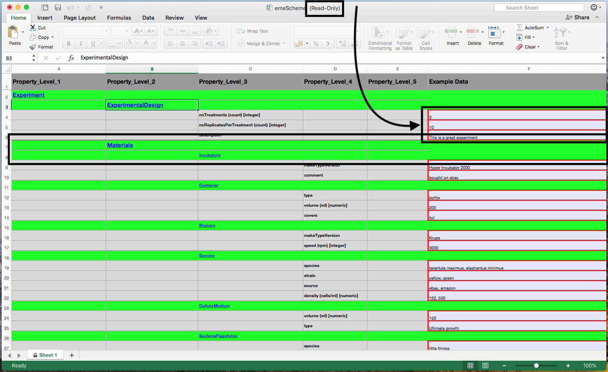

```{r setup, include = FALSE}
knitr::opts_chunk$set(
	echo = FALSE,
  collapse = TRUE,
  comment = "#>"
)
library(emeScheme)
# library(here)
# library(magrittr)
# library(dplyr)
# library(knitr)
library(kableExtra)
# library(plantuml)
#
v <- read.dcf(here::here('DESCRIPTION'), all = TRUE)[['Version']]
```

# The R Package

The Definition of the emeScheme is done in an R package, which gives all the tools to enter the meatada and to export it into xml.

## Installation

The package is not yet on CRAN. Therefore it needs to be installed from github. This will install the last verion on github. 

For a list of releases see [here](https://github.com/Exp-Micro-Ecol-Hub/emeScheme/releases)

```{r echo=TRUE, eval = FALSE}
## install the devtools package if not installed yet
# install.packages("devtools")

## install the last version of emeScheme from github
devtools::install_github("Exp-Micro-Ecol-Hub/emeScheme", build_opts = c("--no-resave-data"))

## install a specific release, e.g. v0.8, of emeScheme from github
devtools::install_github("Exp-Micro-Ecol-Hub/emeScheme", ref = "v0.8", build_opts = c("--no-resave-data"))
```


## Entering new Metadata

To enter new data to the emeScheme, you have to

```{r echo=TRUE, eval = FALSE}
library("emeScheme")
enter_new_metadata()
```

This should open Excel and the file should look similar to this:



1) The file is saved in a temporary directory. It needs to be saved at a different location, if you want to keep the changes. 
2) Data can only be entered in the green cells with. All other cells are write protected.

After entering the data, save it to a location for further processing.

## Importing Data from Excel Sheet

Next, you have to import the data entered in the Excel sheet int R:

```{r echo = TRUE, eval = FALSE}
x <- read_from_excel(
      file = "PATH/WHERE/THE/FILE/IS/file.xlsx",
      keepData = TRUE,
      verbose = TRUE,
      raw = FALSE 
)
```

For convenience, we use the exapmle data included in the package by using

```{r}
x <- read_from_excel(
      file = system.file("googlesheet", "emeScheme.xlsx", package = "emeScheme"),
      keepData = TRUE,
      verbose = TRUE,
      raw = FALSE 
)
```

## Print emeScheme Data

emeScheme Data can be printed by using the `print()` function. The function has three arguments which control the printout:

* `printAttr`: if `TRUE` (default) print the **basic** attributes prefixed with `A   `
* `printExAttr`: if `TRUE` print the **all** attributes prefixed with `X   `
* `printData`: if `TRUE` (default) print the data prefixed with `D   `

```{r, echo = TRUE}
print(
  x,
  printAttr = FALSE,
  printExtAttr = FALSE,
  printData = FALSE
)
```

```{r, echo = TRUE}
print(
  x,
  printAttr = TRUE,
  printExtAttr = FALSE,
  printData = FALSE
)
```

```{r, echo = TRUE}
print(
  x,
  printAttr = TRUE,
  printExtAttr = TRUE,
  printData = FALSE
)
```

```{r, echo = TRUE}
print(
  x,
  printAttr = TRUE,
  printExtAttr = TRUE,
  printData = TRUE
)
```
## Converting Metadata to xml

You can export the data to an an xml file:

```{r example_export_xml, echo=TRUE, eval = FALSE}
emeSchemeToXml( x, tag = "ExampleData" )
```

When you specify the argument `file`, the xml will be saved:

```{r example_export_xml_file, echo=TRUE, eval = FALSE}
emeSchemeToXml( x, tag = "ExampleData", file = "ExampleData.xml" )
```


<!-- ## Re-import from xml into R -->

<!-- **<span style="color:red">TODO This needs some more work see issue #5 </span>**  -->

<!-- ```{r example_import_xml, eval = FALSE} -->
<!-- addDataToEmeScheme() %>% -->
<!--   emeSchemeToXml( tag = "Example Data" ) %>% -->
<!--   xmlToEmeScheme() %>% -->
<!--   str() -->
<!-- ``` -->

## Validation
### `emeSchemeSet_raw` against `emeScheme`

When running `read_from_excel()`, the dafault is to validate the raw data before conversion to an `emeScheme` object to guarantee a valid `emeScheme` is returned. If the validation fails, an error is raised.

### xml against xsd

Not incorporated yet but planned.

## General things

The emeScheme data in R can be also saved, loaded, and edited using the standard R commands.


